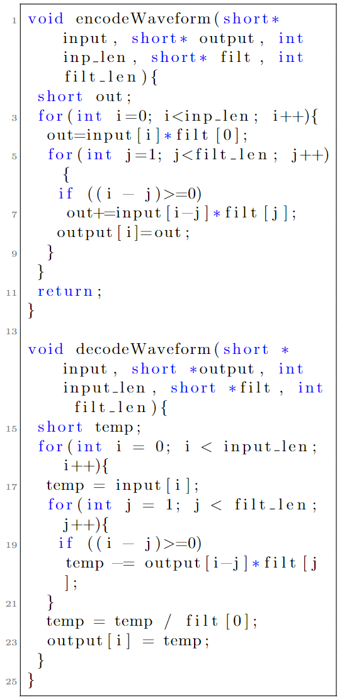

# Summary

An efficient method for high performance lossless compression of digitized analog signals within the HDF5 library and data format is presented. This algorithm, called Delta-Rice, was developed for the Nab experiment, a fundamental neutron physics experiment, but is broadly applicable to other experimental efforts requiring lossless compression of noisy data. This is a two-step process where correlations between consecutive datapoints are reduced before being passed to a traditional Rice compression algorithm. The reduction of correlations can be tuned to match each dataset through adjustment of the pre-processing filter. A routine for determining the optimal filter for a dataset is demonstrated. Also demonstrated are modifications to allow deployment of this algorithm to both FPGA and GPU architectures. When applied to data collected by the Nab data acquisition system, this method created output files which were 29% their initial size, and was able to do so with an average read/write throughput in excess of 2 GB/s on a single CPU. Compared to the widely used G-zip compression routine, Delta-Rice reduces the file size by 33% more with over an order of magnitude increase in read/write throughput. Delta-Rice is available to users through the HDF5 library.

# Introduction

Being able to digitize, process, and record analog signals is a critical part of many modern physics experiments. For large-scale or high-statistics experiments in particular, the resulting datasets can require petabytes of storage leading to difficulties in both storage and data distribution. The Nab experiment, which will precisely characterize the decay of free neutrons, is one such high-statistics experiment [@Fry2019]. During the multi-year experiment, $10^9$ events will be measured with a data acquisition (DAQ) system recording between $100$ and $400$ MB/s of digitized detector data [@david_2022]. The resulting dataset is expected to reach several petabytes in size. The cost and complexity of storing and distributing this dataset to collaborators motivated the development of a custom compression routine. 

The data size reduction algorithm must meet three primary requirements. First, the algorithm needs to be lossless. Data reconstructed from the compressed files must be equivalent to the input data. Second, it must be able to compress data faster than the data are acquired. This allows the compression to be performed in real-time as part of the data acquisition pipeline reducing the local storage requirements and negating the need for a buffer space to hold data pre-compression. Third, it must be easily accessible to all users and support multiple analysis methodologies, programming languages, and hardware platforms including GPUs. While software such as Gzip [@gzip] or 7-Zip [@7zip] is easily accessible and can significantly reduce the size of a dataset, the throughput of these methods is not at the level required for real time compression.

The Delta-Rice algorithm described in this paper offers real-time lossless compression/decompression that is tailored to Nab experimental dataset. This algorithm is adjustable to other experimental datasets and designed to be compatible with CPU, GPU, and FPGA architectures. A parallel CPU implementation of this compression software is available through the HDF5 library [@hdf5].

# Algorithm Overview
This algorithm is a two-step process: the digitized signal is first passed through an encoding operation with the intention of de-correlating the data and preparing it for the second step of Golomb coding [@golomb]. This two-step process is effective for several reasons. First, both the encoding operation and Golomb coding are computationally simple algorithms that can be easily deployed to CPUs, GPUs, and FPGAs. Secondly, subsequent samples from digitized analog signals are inherently correlated with each other. These correlations can be exploited to better prepare the data for Golomb Coding resulting in a greater level of compression. In the subsequent sections we describe the Golomb Coding operation and the resulting requirements placed on the preparatory encoding filter.

## Golomb Coding
The requirements for the first-state preparatory encoding are driven by the behavior of Golomb coding, described here. Golomb coding was chosen for this compression routine specifically for its simplicity, throughput, and storage efficiency. In addition it does not require a significant amount of additional information to be stored alongside the compressed data in order for the decompression routine to function which improves storage efficiency further. This algorithm can be easily deployed on both GPUs and FPGAs with minimal adjustments/optimizations required to reach peak throughput. 

Golomb coding functions by encoding a value $x$ in 2 pieces: $q$, the result of a division by a tunable parameter $m$, and $r$, the remainder of that division. Golomb coding expects unsigned values, but can be extended to support signed numbers by interleaving positive and negative values. A straightforward way of occomplishing this is $x\prime = 2*x$ for $x>=0$ and $x\prime = 2|x|-1$ for $x<0$. With $x\prime$ known, q and r can be calculated via $q = x\prime // m$ and $r=x\prime - q * m$ where $//$ represents floor division. These $q$ and $r$ values are then packed together into the final output. 

The parameter $q$ is stored in Unary coding, and $r$ is stored in truncated binary encoding. The optimal $m$ depends on the standard deviation of the data being compressed, and is determined empirically to yield the maximum compression ratio. Unary coding takes $q+1$ bits to store $q$, while the storage of $r$ takes either $s-1$ or $s$ bits, where $s=\lceil \log_2(m) \rceil$, if $0\leq r<2^{s}-m$ or if $2^{s}-m \leq r < m$ respectively. In the simpler case of Rice coding [@rice], the algorithm is the same except $m$ is restricted to only powers of 2. This simplifies the storage of the remainder $r$ to only needing $s$ bits. In both Golomb and Rice coding, large $q$ values can be problematic due to using Unary coding for the quotient $q$ which could expand to being larger than the initial storage size. Statistically this should be unlikely in a dataset that is well suited for Golomb/Rice coding which is one of the purposes of the preparatory encoding enabled in this algorithm. In the case that this does occur still, a cutoff parameter $c$ is defined in this algorithm to set an upper limit for the value of $q$ to prevent the expansion of the storage for particularly high magnitude values of $x$. This is a tunable parameter, but in this implementation it is set to $8$ by default. 

Once the calculation of $q$ and $r$ is complete, they are stored sequentially in a 64 bit container in the order $qr$. Multiple sets of $qr$ will be stored in each 64 bit container. Once the first 32 bits of a container are occupied, they are output as a single 32 bit unsigned value, and any remaining bits within the container are shifted to the start to begin the cycle again. The remaining bits are shifted to the start of the 64 bit container and the process continues until all values of $x$ have been encoded. This ensures that no bits are wasted in the 32 bit unsigned values that are written to file, except for unused bits in the final 32 bit value output. To prevent the decompression algorithm from misinterpreting these unused bits, the total number of elements $x$ that were compressed is recorded as well. An demonstration of this packing is shown in the table below for an 8-bit container with a 4-bit output size where the first bit pack added bits 1, 0, 1 and the second ads 0, 1, 1. 

| Bit          | 0 | 1 | 2 | 3 | 4 | 5 | 6 | 7 |
|--------------|---|---|---|---|---|---|---|---|
| Initial      | 0 | 0 | 0 | 0 | 0 | 0 | 0 | 0 |
| 1st Pack     | 1 | 0 | 1 | 0 | 0 | 0 | 0 | 0 |
| 2nd Pack     | 1 | 0 | 1 | 0 | 1 | 1 | 0 | 0 |
| After Output | 1 | 1 | 0 | 0 | 0 | 0 | 0 | 0 |

The probability density function of values after preparatory encoding, $P(x)$, is used to determine the optimal value of both $m$ and $c$. These are found via minimization of $$ B(m, c) = \sum_i P(x_i) * b(x_i, m, c, b_0) $$ where $b(x_i, m, c, b_0)$ is the number of bits required for each datapoint. The sum is over all possible values of $x$ as defined by the finite range of digitized values e.g. $x$ ranges from $0$ to $16384$ for a 14 bit digitizer. For the simple case of a Gaussian probability distribution, the relationship between the standard deviation $\sigma$ and $m$ is explored in Figure \ref{fig:CorrelationPlot}. Note that datasets with smaller standard deviations have better compression performance with Golomb coding, but are also more sensitive to the choice of $m$ parameter. The cutoff value $c$ should be optimized with a restriction on the upper size to prevent $c+1 + b_0$ from being larger than the output storage container size of 32 bits. In the case that the cutoff is reached, the compression algorithm outputs the cutoff value in Unary coding followed by $x\prime$ in binary. This greatly increases the number of bits required to encode values that are just larger than the cutoff value for $q$, but with a well tuned preparatory encoding filter and $m$ value, the probability of this occurring is small enough to have a negligible impact on the final output size.

## Preparatory Encoding
The goal of this encoding operation is to manipulate the incoming data into a form that is more optimal for Golomb Coding. As previously discussed, a more dense probability distribution is preferable as well as avoiding extremes in the inputs. The initial encoding operation is performed using a convolution filter. The implementation of the convolution can be iterative or recursive, with the optimal choice depending on the hardware and configuration. FFT-based convolutions, while computationally efficient for convolving large arrays, are not used here because the filters are assumed to be small. Filters are preferred to be small as the filter must be stored alongside the compressed data to allow for decompression and significantly long filters will prevent effective compression. Example functions for encoding and decoding data with a filter are shown in Figure \ref{eqn:EncodeDecode}. The default filter employed in this algorithm is delta encoding, which is defined by a filter of $[1, -1]$.{width="2in"} Figure \ref{fig:ApplyingDelta} shows an example of delta encoding applied to a sample waveform trace. Note the clear reduction in the standard deviation of the data and the movement of the average value to being near 0, both of which improve the compression of the data with Golomb Coding.

{width="4in"}

Not all digitized data will necessarily have its distribution of unique words reduced through delta encoding. The presence of noise and the behavior of the ADC sampling may cause delta encoding to actually expand the distribution of words, which would reduce the compression performance with Golomb coding. As such, the implementation of this compression routine within HDF5 allows for the user to override the delta encoding operation with a different encoding filter. Determining the optimal encoding algorithm for a particular set of data is discussed in the Optimization of Encoding Filters section. 

## Optimization of Encoding Filters
The purpose of the convolution-based encoding filter is to take advantage of correlations in the dataset to better prepare the data for compression with Golomb coding. By default, the encoding performed is delta encoding. This was chosen for two reasons. First, digitized analog signals frequently have strong correlations between subsequent values. Saving the differences between values can greatly decrease the spread in the data as seen in Figure \ref{fig:ApplyingDelta}. A dataset with a smaller spread in values, particularly when centered around 0, will compress better with Golomb coding. Second, delta encoding is computationally efficient as it does not require multiplications/divisions and has a length of $2$.

