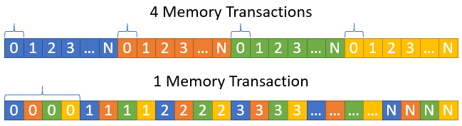

[^1]: Notice: This manuscript has been authored by UT-Battelle, LLC, under contract DE-AC05-00OR22725 with the US Department of Energy (DOE). The US government retains and the publisher, by accepting the article for publication, acknowl-edges that the US government retains a nonexclusive, paid-up, irrevocable, worldwide license to publish or reproduce the pub-
lished form of this manuscript, or allow others to do so, for US government purposes. DOE will provide public access to these results of federally sponsored research in accordance with the
DOE Public Access Plan (http://energy.gov/downloads/doe-public-access-plan).

# Summary

An efficient method for high performance lossless compression of digitized analog signals within the HDF5 library and data format is presented. This algorithm was developed for the Nab experiment, a fundamental neutron physics experiment, but is broadly applicable to other experimental efforts requiring lossless compression of noisy data. This is a two-step process where correlations between consecutive datapoints are reduced before being passed to a traditional Rice compression algorithm. The reduction of correlations can be tuned to match each dataset through adjustment of the pre-processing filter. A routine for determining the optimal filter for a dataset is demonstrated. Also demonstrated are modifications to allow deployment of this algorithm to both FPGA and GPU architectures. When applied to data collected by the Nab data acquisition system, this method created output files which were 29% their initial size, and was able to do so with an average read/write throughput in excess of 2 GB/s on a single CPU. Compared to the widely used G-zip compression routine, Delta-Rice reduces the file size by 33% more with over an order of magnitude increase in read/write throughput. Delta-Rice is available to users through the HDF5 library.

# Introduction

Being able to digitize, process, and record analog signals is a critical part of many modern physics experiments. For large-scale or high-statistics experiments in particular, the resulting datasets can require petabytes of storage leading to difficulties in both storage and data distribution. The Nab experiment, which will precisely characterize the decay of free neutrons, is one such high-statistics experiment [@Fry2019]. During the multi-year experiment, $10^9$ events will be measured with a data acquisition (DAQ) system recording between $100$ and $400$ MB/s of digitized detector data [@david_2022]. The resulting dataset is expected to reach several petabytes in size. The cost and complexity of storing and distributing this dataset, along with the requirements described below, motivated the development of a custom compression routine. 

The data size reduction algorithm must meet three primary requirements. First, the algorithm needs to be lossless. Data reconstructed from the compressed files must be equivalent to the input data to allow for high-fidelity reconstruction of events with minimal bias. Second, it must be able to compress data faster than the data are acquired. This allows the compression to be performed in real-time as part of the data acquisition pipeline reducing the local storage requirements and negating the need for a buffer space to hold data pre-compression. Third, it must be easily accessible to all users and support multiple analysis methodologies, programming languages, and hardware platforms including GPUs and FPGAs. While software such as Gzip [@gzip] or 7-Zip [@7zip] is easily accessible and can significantly reduce the size of a dataset, the throughput of these methods is not at the level required for real time compression.

The Delta-Rice algorithm described in this paper offers real-time lossless compression/decompression that is tailored to Nab experimental dataset. This algorithm is adjustable to other experimental datasets and designed to be compatible with CPU, GPU, and FPGA architectures. A parallel CPU implementation of this compression software is available through the HDF5 library [@hdf5].

# Algorithm Overview
This algorithm is a two-step process: the digitized signal is first passed through an encoding operation to de-correlate the data and prepare it for the second step of Golomb coding [@golomb]. This two-step process is effective for several reasons. First, both the encoding operation and Golomb coding are computationally simple algorithms that can be easily deployed to CPUs, GPUs, and FPGAs. Second, subsequent samples from digitized analog signals are inherently correlated with each other. These correlations can be exploited to better prepare the data for Golomb Coding resulting in a greater level of compression. In the subsequent sections we describe the Golomb Coding operation and the resulting requirements placed on the preparatory encoding filter.

## Golomb Coding
The requirements for the first-state preparatory encoding are driven by the behavior of Golomb coding, described here. Golomb coding was chosen for this compression routine specifically for its simplicity, throughput, and storage efficiency. In addition it does not require a significant amount of additional information to be stored alongside the compressed data in order for the decompression routine to function, which improves storage efficiency further. This algorithm can be easily deployed on both GPUs and FPGAs with minimal adjustments/optimizations required to reach peak throughput. 

Golomb coding functions by encoding a value $x$ in 2 pieces: $q$, the result of a division by a tunable parameter $m$, and $r$, the remainder of that division. Golomb coding expects unsigned values, but can be extended to support signed numbers by interleaving positive and negative values. A straightforward way of occomplishing this is $x\prime = 2*x$ for $x>=0$ and $x\prime = 2|x|-1$ for $x<0$. With $x\prime$ known, q and r can be calculated via $q = x\prime // m$ and $r=x\prime - q * m$ where $//$ represents floor division. These $q$ and $r$ values are then packed together into the final output. 

The parameter $q$ is stored in Unary coding, and $r$ is stored in truncated binary encoding. The optimal $m$ depends on the standard deviation of the data being compressed, and is determined empirically to yield the maximum compression ratio. Unary coding takes $q+1$ bits to store $q$, while the storage of $r$ takes either $s-1$ or $s$ bits, where $s=\lceil \log_2(m) \rceil$, if $0\leq r<2^{s}-m$ or if $2^{s}-m \leq r < m$ respectively. In the simpler case of Rice coding [@rice], the algorithm is the same except $m$ is restricted to only powers of 2. This simplifies the storage of the remainder $r$ to only needing $s$ bits. In both Golomb and Rice coding, statistical outliers with large $q$ values can be problematic due to using Unary coding for the quotient $q$ which could expand to being larger than the initial storage size. This should be unlikely in a dataset that is well suited for Golomb/Rice coding, which is one of the purposes of the preparatory encoding enabled in this algorithm. In the case that this does occur still, a cutoff parameter $c$ is defined in this algorithm to set an upper limit for the value of $q$. Any values that exceed this cutoff are stored in their original representation. This does expand the storage of statistical outliers, but fixes the upper limit of the storage size. The cutoff parameter $c$ defaults to $8$ in this implementation but can be tuned on a per-dataset basis. 

Once the calculation of $q$ and $r$ is complete, they are packed together in a 64 bit buffer in the order $qr$. Multiple values will be packed in the same buffer until the first 32-bit are occupied. Once the first 32 bits of a container are occupied, they are output as a single 32 bit unsigned value, and any remaining bits within the container are shifted to the start to begin the cycle again. This cycle continues until all values of $x$ have been compressed and output. This ensures that no bits are wasted in the 32 bit unsigned values that are written to file, except for unused bits in the final 32 bit value output. The total number of elements $x$ is written at the beginning of the compressed data chunk so the decompression routine knows how many values to expect. An demonstration of this packing is shown in the table below for an 8-bit container with a 4-bit output size where the first bit pack added bits 1, 0, 1 and the second adds 0, 1, 1. In this example the output size of 4 bits is reached after the 2nd pack so the first 4 bits are output and the remaining entries in the last 4 bits are shifted to the start of the container.

| Bit          | 0 | 1 | 2 | 3 | 4 | 5 | 6 | 7 |
|--------------|---|---|---|---|---|---|---|---|
| Initial      | 0 | 0 | 0 | 0 | 0 | 0 | 0 | 0 |
| 1st Pack     | 1 | 0 | 1 | 0 | 0 | 0 | 0 | 0 |
| 2nd Pack     | 1 | 0 | 1 | 0 | 1 | 1 | 0 | 0 |
| After Output | 1 | 1 | 0 | 0 | 0 | 0 | 0 | 0 |

The probability density function of values after preparatory encoding, $P(x)$, is used to determine the optimal value of both $m$ and $c$. These are found via minimization of $$ B(m, c) = \sum_i P(x_i) * b(x_i, m, c, b_0) $$ where $b(x_i, m, c, b_0)$ is the number of bits required for each datapoint. The sum is over all possible values of $x$ as defined by the finite range of digitized values e.g. $x$ ranges from $0$ to $16383$ for a 14 bit digitizer. For the simple case of a Gaussian probability distribution, the relationship between the standard deviation $\sigma$ and $m$ is explored in Figure \ref{fig:CorrelationPlot}. Note that datasets with smaller standard deviations have better compression performance with Golomb coding, but are also more sensitive to the choice of $m$ parameter. The cutoff value $c$ should be optimized with a restriction on the upper size to prevent $c+1 + b_0$ from being larger than the output storage container size of 32 bits. In the case that the cutoff is reached, the compression algorithm outputs the cutoff value in Unary coding followed by $x\prime$ in binary. This greatly increases the number of bits required to encode values that are just larger than the cutoff value for $q$, but with a well tuned preparatory encoding filter and $m$ value, the probability of this occurring is small enough to have a negligible impact on the final output size.

## Preparatory Encoding
The goal of this encoding operation is to manipulate the incoming data into a form that is more optimal for Golomb Coding. As previously discussed, a more dense probability distribution is preferable as well as avoiding extremes in the inputs. The initial encoding operation is performed using a convolution filter. The implementation of the convolution can be iterative or recursive, with the optimal choice depending on the hardware and configuration. FFT-based convolutions, while computationally efficient for convolving large arrays, are not used here because the filters are assumed to be small. Filters are preferred to be small as the filter must be stored alongside the compressed data to allow for decompression and significantly long filters will prevent effective compression. The functions for encoding and decoding data with a filter can be seen [here](https://github.com/david-mathews-1994/deltarice/blob/master/src/deltaRice.c). The default filter employed in this algorithm is delta encoding, which is defined by a filter of $[1, -1]$. For a signal of $-9, 8, -4, 15, 2, 3, 6$, delta encoding results in $-9, 17, -12, 19, -13, 1, 3$. Figure \ref{fig:ApplyingDelta} shows an example of delta encoding applied to a sample waveform trace. Note the clear reduction in the standard deviation of the data and the movement of the average value to being near 0, both of which improve the compression of the data with Golomb Coding.

{width="4in"}

Not all digitized data will necessarily have its distribution of unique words reduced through delta encoding. The presence of noise and the behavior of the ADC sampling may cause delta encoding to actually expand the distribution of words, which would reduce the compression performance with Golomb coding. As such, the implementation of this compression routine within HDF5 allows for the user to override the delta encoding operation with a different encoding filter. Determining the optimal encoding algorithm for a particular set of data is discussed in the Optimization of Encoding Filters section. 

## Optimization of Encoding Filters
The purpose of the convolution-based encoding filter is to take advantage of correlations in the dataset to better prepare the data for compression with Golomb coding. By default, the encoding performed is delta encoding. This was chosen for two reasons. First, digitized analog signals frequently have strong correlations between subsequent values. Saving the differences between values can greatly decrease the spread in the data as seen in Figure \ref{fig:ApplyingDelta}. A dataset with a smaller spread in values, particularly when centered around 0, will compress better with Golomb coding. Second, delta encoding is computationally efficient as it does not require multiplications/divisions and has a length of $2$.

However, delta encoding is not necessarily the best encoding filter for all datasets. Determining the optimal encoding filter is a non-trivial minimization process with a strict set of rules that must be followed. First, any encoding filter must be entirely comprised of only integer values because Golomb coding is designed for integer values. It is possible to pass a floating point value to a Golomb coding algorithm but, due to how they are represented in binary, $1.0$ in 32-bit floating point precision encodes more poorly than $1$ in 32-bit integer precision. The filter should also not have zeros on either end. A zero at the end of the filter does not affect the distribution of values being fed into the Golomb coding operation, except in the null case of $[0]$, and results in needing to store a longer encoding filter alongside the compressed data which is undesirable. An example of a simple minimization routine that obeys these rules is provided with this compression library [here](https://github.com/david-mathews-1994/deltarice/tree/master/src). 

This algorithm starts with the user providing an initial guess as to the best encoding filter and starts the search for a minimum near that filter. Only filters of the same length, $N$, as the initial filter will be tested. The function $nearFilts$ identifies possible alternate filters in the surrounding space of the initial guess, while automatically excluding those with $0$ on either end. The user passed function $objFunc$ then tests each of these filters to see if they provide a smaller average bit size. If such a filter is found, the process is repeated again around that filter until a minimum is found. This algorithm stores previously calculated average bit sizes in case the algorithm checks the same filter definition multiple times. This algorithm returns to the user the whole history of encoding filters tested and how small the average entry in the dataset was for each of those filters. It is possible for a simplistic algorithm such as this to fall into local minima but this can be mitigated by adjusting the size of the search parameter which expands the space around each filter that will be searched. 

{width="4in"}

It is important to note that the encoding operation will take more time as the filter length increases due to the convolution operation. In addition, a longer filter will also require more storage as it must be stored alongside the compressed data in order for the decompression operation to function, but for large datasets this contribution to the output size is negligible. A comparison between filter length, compression performance, and encoding time is shown in Figure \ref{fig:SizeVsEnc} for data from the Nab experiment. Delta encoding offers the highest throughput, other than not encoding at all, while also offering the best compression performance of the filters tested so the choice in encoding filter for Nab was simple. In testing on preliminary data from the NOPTREX collaboration [@noptrex], the encoding filter $[1, -1, 1, -1]$ reduced the data size $14\%$ further than delta encoding, but took $\approx 8\times$ longer to perform the encoding. Depending on the experimental priority, data reduction vs throughput, the decision can be made as to which encoding filter is chosen. If, for example, the reduction in speed from a more complicated encoding filter was not enough to lower the compression throughput below the data acquisition rate then it may be deemed an acceptable slowdown.

# Implementation

The Delta-Rice compression routine is accessible to users through the HDF5 library \[@hdf5] as filter ID $32025$. The source code along with installation instructions are available [here](https://gitlab.com/dgma224/deltarice). In the HDF5 library, any dataset stored with compression enabled will be split between different chunks. For example, a $1000\times1000\times1000$ dataset could be stored in $1000$ chunks that are each $1000\times1000$. Each chunk is then compressed and decompressed individually. Besides specifying the tunable parameter $m$ and the encoding filter to be used, the user can also tell the algorithm the length of the smallest axis of the data being stored. For datasets such as from the Nab experiment where multiple detector signals are stored in a singular chunk, the length of the signals is a natural choice for this parameter. If this is specified, and the user has OpenMP configured on their system, then the algorithm will utilize multiple threads to compress/decompress the data within a singular chunk more rapidly. The number of threads used is determined by either the maximum number of threads as configured within OpenMP, or the size of the dataset, whichever is smaller.

Performing the compression in parallel does require more memory due to needing to allocate temporary buffers. The output size from each thread is unknown so a larger buffer is created than is necessary. Its size is based on the cutoff parameter $c$ implemented in the system, setting an upper limit on how large the dataset could be expanded to in the worst case. Once each piece of the chunk is compressed into its portion of the output buffer, each portion is serially iterated through and saved to the file. To avoid this issue during the decompression operation, the size of each encoded portion of the chunk is stored prior to the compressed waveform section. This allows the algorithm to initially step through the compressed data, determine how many chunks there are and how large each one is, then hand off the decompression to the parallel processes in OpenMP. Datasets written in parallel can be read by either serial or parallel decoding operations. However, a dataset that was written serially, unless it was specified to have multiple portions, will be read serially due to the individual portions not being defined otherwise. Also note that in the current implementation, only $m$ values that are powers of 2 are allowed. This simplifies the compression routine and increases throughput. Integration into the HDF5 library and the installation process was patterned after the Bitshuffle algorithm [@MASUI2015181], another 3rd party compression routine that is available in HDF5. 

## GPU Deployment

Developing such an algorithm on GPU faces several challenges from an efficiency standpoint, mostly originating from the inherently serial nature of the encoding and bit packing operations. The simplest way to address this issue is to process multiple data segments in parallel, similarly to how the CPU parallelization with OpenMP behaves. By doing this, each segment can be processed serially as required by the algorithm, and multiple GPU cores can be utilized. To maximize throughput using this method, it is important to rearrange the storage of the segments to take advantage of the 32, 64, or 128 byte memory transactions from global memory. An example of this optimization is shown in Figure \ref{fig:MemoryAlignment}. For segments stored in a flattened 1D array, the memory layout is generally defined as $segments[i+L*j]$ where $i$ references the index in the segment, $j$ is the segment number, and $L$ is the length of each segment. This means that if the function is accessing the first value in each segment, these memory transactions are separated by $L$ values and would not take advantage of the memory transaction size. By transposing this array such that the segments are stored as $segments[j+i*N]$, where $N$ is the number of segments, this can be avoided. When the GPU accesses the first element in each segment in this configuration, they are all packed together in storage allowing full utilization of the memory transaction size.

{width="4in"}

Implementing the Golomb/Rice Coding in the GPU does not require significant modification from the CPU implementation, except for in the bit packing operation. The computations of the $q$ and $r$ values can be done across all data segments in parallel across the various GPU threads for maximum throughput. In the special case of Rice coding, the calculation of $q$ and $r$ can be done with bit shifts instead of division and modulo operations improving the performance even further. The main difficulty of Golomb coding on GPU is the packing of the 32-bit containers. Using the transposed memory format discussed previously greatly improves the throughput here as each thread can load a batch of $x$ values, calculate $q$ and $r$, pack the bits together, and export that batch instead of performing this task in series. Just like on CPU with OpenMP, as the compressed size of each segment is not known in advance, a buffer is allocated with enough space to store each segment assuming that compression failed on each datapoint. These segements can then be transfered back to CPU to be compacted together, or compacted on GPU and then sent back. Which is the faster method will depend on the GPU and the interface between CPU and GPU memory spaces. 

Integrating a GPU version of this algorithm with HDF5 is made possible through the functions H5D_WRITE_CHUNK and H5D_READ_CHUNK. These allow the user to bypass the HDF5 filter pipeline, which would otherwise automatically perform the compression and decompression on CPU, and directly read or write from the chunk in the datafile. In order to reach peak throughput it is recommended to use the GPU to read/write multiple chunks at a time to fully leverage the parallel architecture. GPU-based decompression in particular is most effective when the subsequent data analysis operations are performed on GPU, otherwise the memory transfers between RAM and VRAM will reduce the throughput.

## FPGA Deployment

The compression of individual values on FPGA is fairly straightforward, but there are some complications that arise in data readout. FPGAs naturally handle recursive algorithms and the numerical operations involved in this process are not inherently computationally intensive, especially in the special case of Rice coding, where divisions can be replaced with bit shifts. A version of the algorithm, using delta encoding as the encoding filter, is shown in Figure \ref{fig:FPGAAlgorithm}.

{width="4in"}

The most difficult algorithmic problems are packing of the compressed values in storage containers and handling error cases where the compression fails and the values are expanded in size. Similarly to what was prescribed earlier, a cutoff value will need to be established to prevent expansion of the values to too great of a size. As is done on the CPU and GPU, a temporary storage location must be established that is larger than the incoming size of the data for incoming data to be encoded into until the temporary buffer is full. Once the container is full of encoded data, it can be added to some memory storage location or exported to some other process for archival of the dataset. Another difficulty with FPGA deployment is getting the data to and from the FPGA, just as with the GPU. In situations where the data originates on the FPGA, such as data acquisition systsems, some of this difficulty is mitigated, but in general the data transfer times are a significant bottleneck for this routine. 

However, one benefit of the FPGA, is that unlike on a CPU or GPU, the time required to compress a fixed length array is deterministic making it ideal for real-time applications such as data acquisition systems. In addition, deploying this algorithm on FPGA makes it possible to compress the data before being sent to the acquistion computer, allowing systems to increase their theoretical throughput in the case that the bandwidth to the host system was the bottleneck. This is particularly relevant for the NI PXIe 5171 FPGAs used in the Nab experiment due to the 4 GB/s MXIe connection that supports 16 modules. By transferring the compressed data stream instead of the uncompressed original values, the effective bandwidth of these systems can be significantly increased.

# Performance
The performance of the algorithm was tested against several other compression routines to determine which is the best suited for deployment in real-time data acquisition and analysis systems. Both the reduction in size and the rate of the compression were compared. All tests, unless otherwise stated, were performed on the machine described here. A RAM disk was used for the storage allocation to allow for peak throughput and reduce the effect of disk I/O on the results. 

 - OS: Ubuntu 22.04
 - CPU: AMD Threadripper Pro 5955WX
 - RAM: 4x32 GB DDR4 @ 3200 MHz
 - Storage: tmpfs

The competing algorithms used during testing are all commonly available in HDF5 implementations: Gzip, LZF, and Bitshuffle. Testing was performed in Python using the h5py library to manage the reading and writing from the HDF5 file [@h5py]. Each test was performed 10 times to reduce random variance in the results and the mean of these tests is reported. For all testing, the initial data is stored in memory before being written to the file. All data were written to a ramdisk configured with tmpfs to reduce dependence on hard-drive read/write performance. An additional set of benchmarks were done without compression enabled to establish the baseline file I/O performance in the system for each dataset. The Delta-Rice algorithm was run in both single-threaded and multi-threaded mode to show the scaling performance of the algorithm and used the default $m=8$ parameter and the delta encoding filter for all datasets. Gzip, LZF, and Bitshuffle were all run with the default parameters. Figure \ref{fig:ComparingSignalFeatures} shows examples of the signal features from each experiment. Each signal type has very different shape features and lengths deliberately to test the flexibility of the algorithms. 

{width="4in"}

The first results are for the Nab experiment dataset. All methods used the same chunk size of $2000\times7000$ and the segment length in Delta-Rice was set to 7000. 

| Compression Method      | File Size (%) | Read (MB/s) | Write (MB/s) |
|-------------------------|---------------|-------------|--------------|
| No Compression          | 100           | 3587        | 2906         |
| Gzip                    | 39            | 374         | 71           |
| LZF                     | 59            | 717         | 554          |
| Bitshuffle (32 threads) | 38            | 1852        | 2131         |
| Delta-Rice (1-thread)   | 29            | 229         | 500          |
| Delta-Rice (32-thread)  | 29            | 1782        | 2387         |

The second set of testing was performed on data from the NOPTREX collaboration [@noptrex]. All methods used a chunksize of $32\times500000$ with a segment length of $500000$ specified for the Delta-Rice method. 

| Compression Method      | File Size (%) | Read (MB/s) | Write (MB/s) |
|-------------------------|---------------|-------------|--------------|
| No Compression          | 100           | 3792        | 2829         |
| Gzip                    | 22            | 472         | 75           |
| LZF                     | 44            | 767         | 670          |
| Bitshuffle (32 threads) | 26            | 1201        | 2754         |
| Delta-Rice (1-thread)   | 25            | 435         | 855          |
| Delta-Rice (32-thread)  | 25            | 2235        | 2548         |

The third suite of tests were run on simulated signals from the nEDM@SNS experiment. All methods used a chunk size of $32\times81920$ and a segment length of $81920$ was set for the Delta-Rice method. 

| Compression Method      | File Size (%) | Read (MB/s) | Write (MB/s) |
|-------------------------|---------------|-------------|--------------|
| No Compression          | 100           | 3759        | 3799         |
| Gzip                    | 29            | 440         | 75           |
| LZF                     | 49            | 722         | 662          |
| Bitshuffle (32 threads) | 30            | 1833        | 1353         |
| Delta-Rice (1-thread)   | 27            | 436         | 539          |
| Delta-Rice (32-thread)  | 27            | 1717        | 2084         |

For these datasets, the Delta-Rice algorithm either matches or outperforms the other algorithms in both file size reduction and read/write throughput. The only case where Delta-Rice doesn't offer the best size reduction is for the NOPTREX dataset where Gzip reduced the file size 3% more, but at the cost of several times slower read/write performance. The Bitshuffle algortihm was the closest competitor in these tests but was consistently producing a few percent larger files. 

## GPU Performance Testing

For testing GPU performance a new computer was used and its specifications are below. 

 - OS: Red Hat Enterprise 7.9
 - CPU: AMD EPYC 7513 
 - RAM: 512GB DDR4
 - Storage: tmpfs
 - GPU: Nvidia A100 80GB

The most straightforward way of implementing this routine on GPU is by compressing/decompressing one chunk of data in parallel, similar to how it is performed on CPU. While it is possible to handle multiple chunks at once, this was not done during testing to keep the configuration as similar as possible to the CPU tests. For a chunk that is $2000\times7000$ as for the Nab dataset testing before, that would require $2000$ independent threads operating in parallel on a GPU for both the compression and decompression operations. Depending on the GPU in particular being used, that may be either too many or too few depending on the number of compute units available in the system. Tuning will need to be performed on a per-GPU basis to optimize the chunk size for throughput. For this testing, a few different chunk sizes were used to demonstrate this on the Nab dataset. The table below is for the same chunk size of $2000\times7000$ that was used previously on the Nab dataset. Only multi-threaded CPU performance is shown below. Note that File in these tests denotes the source or target was the HDF5 file stored using tmpfs whereas RAM denotes the data started or stopped as an array in memory outside of the HDF5 file structure.

| Method               | Data Source Location | Target Location | Throughput |
|----------------------|----------------------|-----------------|------------|
| CPU No Compression   | RAM                  | File            | 6000 MB/s  |
| CPU No Compression   | File                 | RAM             | 7100 MB/s  |
| CPU With Compression | RAM                  | File            | 1250 MB/s  |
| CPU With Compression | File                 | RAM             | 2050 MB/s  |
| GPU With Compression | RAM                  | File            | 1210 MB/s  |
| GPU With Compression | File                 | RAM             | 2150 MB/s  |
| GPU With Compression | VRAM                 | File            | 2550 MB/s  |
| GPU With Compression | File                 | VRAM            | 3375 MB/s  |

In this particular set of tests, the GPU compression/decompression performance was roughly the same when the data source or destination were not on the GPU. These cases require an additional data transfer which reduces throughput. The highest throughput case is when the data is read compressed from the file, decompressed on the GPU, and remains on the GPU. This is because the total amount of data transfered to and from VRAM is the smallest of all cases. Increasing the chunk size to $20000\times7000$ improved performance of the compression routine across the board due to allowing for more parallel instances at once as shown below.

| Method               | Data Source Location | Target Location | Throughput |
|----------------------|----------------------|-----------------|------------|
| CPU No Compression   | RAM                  | File            | 5850 MB/s  |
| CPU No Compression   | File                 | RAM             | 7050 MB/s  |
| CPU With Compression | RAM                  | File            | 2850 MB/s  |
| CPU With Compression | File                 | RAM             | 2550 MB/s  |
| GPU With Compression | RAM                  | File            | 1300 MB/s  |
| GPU With Compression | File                 | RAM             | 2450 MB/s  |
| GPU With Compression | VRAM                 | File            | 2800 MB/s  |
| GPU With Compression | File                 | VRAM            | 5900 MB/s  |

The GPU compression and decompression performance truly shines when the data originates or has its final destination on the GPU. When the situation requires transfers to and from the GPU, the performance is significantly lower, and in general the multi-threaded CPU implementation is a better choice. However, if a user is in a situation where they are reading data from a file with the intent of processing on GPU, this routine can significantly improve the read performance to nearly the full throughput of an uncompressed data file. 

## FPGA Performance Testing

Unlike the CPU and GPU, FPGAs are deterministic devices that will perform a fixed set of operations every clock cycle. As such, the clock frequency of the compression or decompression function will determine throughput of the routine. For example, if the algortihm is compiled to run at 125 MHz, then the throughput of the code will be $\approx 238$ MB/s as every clock cycle will compress a single $16$ bit number. This compression routine, using the delta encoding filter, was synthesized for a single channel of the NI PXIe 5171 Oscilloscope Modules used in the Nab experiment at a rate of $250$ MHz, or $\approx 480$MB/s. While this is not a high enough throughput to handle the full 8 channel data stream from the system, it is enough for applications such as the Nab experiment where the cumulative data rate from the 16 FPGA system is expected to be between $100$ and $400$ MB/s [@david_2022]. By having the FPGA compress data from multiple channels simultaneously, it is possible for this rate to be improved even further, but the number of simultaneous streams and maximum frequency will depend on the FPGA. 

# Conclusion
The Delta-Rice algorithm presented in this document is a general purpose method for compressing digitized analog data at a rapid rate on CPU, GPU, or FPGA. This algorithm's two step process first reduces the inherent correlations between subsequent values in digitized signals to prepare the dataset for the second step in the process, which is Golomb/Rice coding. This method can be generalized to a variety of systems that depend on recording digitized analog signals while offering greater throughput than commonly available routines in the HDF5 library. Currently, the algorithm is tailored for 16-bit integer data but it can be generalized for arbitrary precision integer data with some minor modifications. As demonstrated for CPUs, this algorithm outperforms many traditional compression algorithms implemented in HDF5 in both the achieved compression ratio and also read/write throughput for waveform data. For GPUs, the performance of this routine far outscales that of the CPU implementation, particularly when decompressing data for analysis on the GPU. For the Nab experiment, this algorithm will be implemented on CPU to compress the incoming data in real time reducing the output data size to $29\%$ of the original size.

